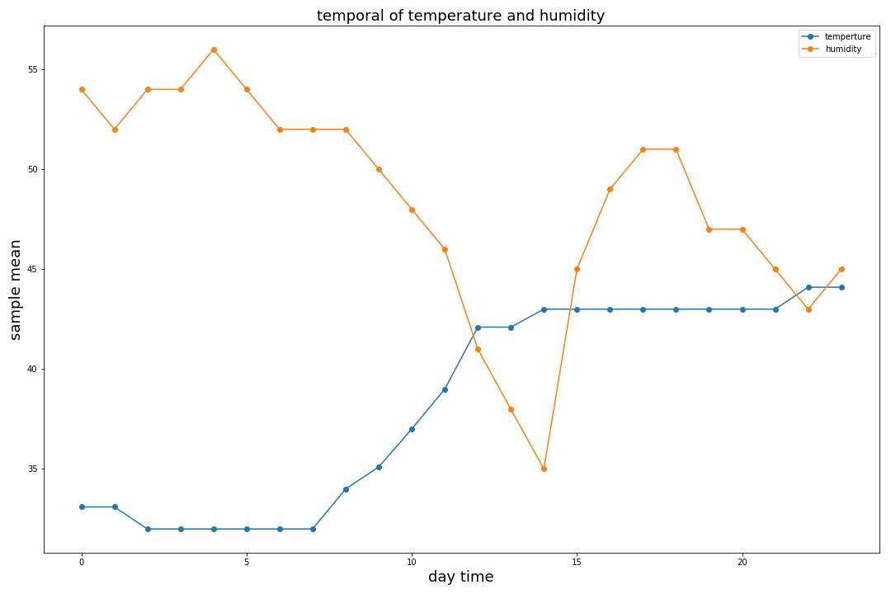

 # Homework 9
 
 ### Review of plot by Chun-Chieh Tsai
 
 #### Completed by #JKtours (Jonathan Kastelan)

#### The review comprises three parts:
   1. Clarity
   2. Aesthetics and selection of visual representation for information presentation
   3. Overall assessment (opinion)

#  
  
## Clarity

The plot is a clear visual, showing how temperature and humidity vary over time.

To make the chart even more impactful, here's a list of modifications you could incorporate:

**1. Plot title:** Make it meaningful and interesting. What are you plotting the temperature and humidity of? Is it the mean values of this for NYC? Is it mean value of these variables across subway stations? Try to give the reader some idea of why you're plotting this in the title also. You want it to be thought provoking, and pique their interest. Make it bigger and bold too.

**2. Legend:** Make it easier for your reader to interpret. Make it bigger. At the moment, it's like an eye test to understand.

**3. Chart Axes:** The variables you're plotting may not be in the same units, but the chart appears like they are comparable. I'm assuming temperature is in degrees Farenheit, and Humidity is a percentage (max 100%). This isn't clear on the chart. Make it clear, update the y-axis label to something other than 'sample mean'. Similar for x-axis, it's labelled 'day time' - what you mean is 'time of day', or the 'hour'. If it's hour, it's also not clear which hour corresponds with what time? Is zero (0) midnight? You could represent this as time using 2400hr clock; it's a small change and gives the reader **much more information** about what they're looking at.

**4. Gridlines:** Consider using gridlines on both the x and y-axis. Some faint grey lines would help readability and not distract much from the data - consider including. Good for the ink-to-information ratio.

## Aesthetics and selection of visual representation for information presentation

The chart type selected is a good option. It's accurate and functional. Presenting data which varies over time is well represented with a line graph. Like it!

Also, reviewing the choice of colors, they are also good options and create good contrast for the reader (Orange and Blue). Even under different color blindness scenarios the colors perform well - **full marks for color choice**.

## Overall assessment (opinion)

A few observations outlined above to make more impactful. 

Not a great deal of points here for creativity; and this could be enhanced with some simple captions or reasons why your reader would or should be interested in the chart.

The data itself is pretty interesting. I'd consider myself a chart enthusiast, and even with the basic visual like this, I'm interested to know why the sharp decrease in humidity between hours 10 and 14. There must be a reason for this? Is there a natural explanation for this? Is it a broken sensor? This provides an opportunity for a **callout** or **caption**. 

Similarly for temperature which appears constant between *hours 3 and 7*, and again between *hours 14 to 21*. You've got my interest, and there's something going on here; but it's not 100% clear on the chart - so I leave confused. This is easily attended to with an explanation or caption about the interesting characteristics of the data.

Nice job anyhow - and hopefully you find the assessment useful.

