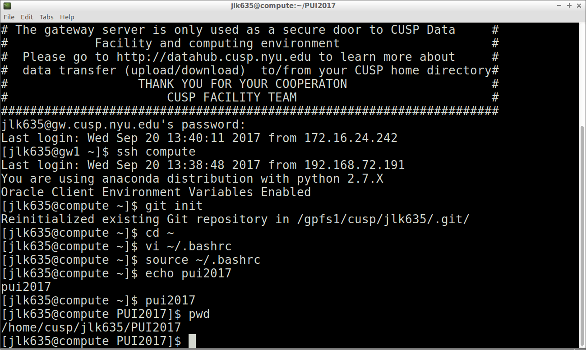
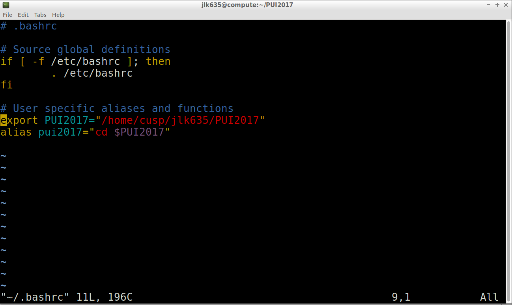

# PUI2017_jlk635

I created a directory in my working directory on the CUSP server called PUI2017.

Following this, I set up an environmental variable PUI2017 which points to the directory /home/cusp/jlk635/PUI2017 and saved it in my .bashrc.

I then set an alias pui2017 which references the environmental variable PUI2017, such that pui2017 take me to the directory /home/cusp/jlk635/PUI2017 each time I open a new terminal.

## pwd commands in terminal

## bash profile alias and env.variable creation

